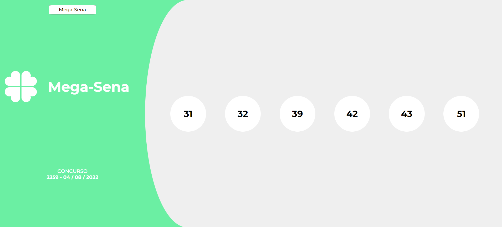
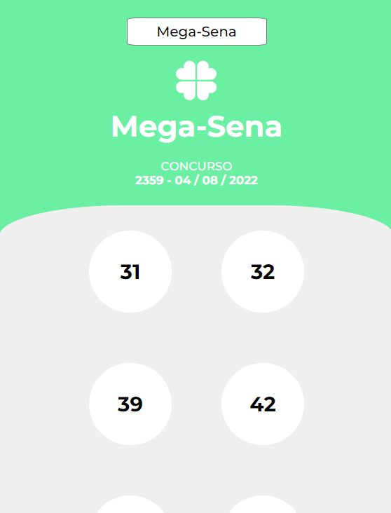

<h1 align="center">Números da Sorte, projeto Loteria 👑</h1>

## Descrição do Projeto

Projeto que busca através de uma api números que já foram sorteados na loteria em seus respectivos sorteios que são apresentados através das opções no select.

### 🛠 Tecnologias

As seguintes ferramentas foram usadas na construção do projeto:

- [Vite](https://vitejs.dev/)
- [React](https://pt-br.reactjs.org/)
- [TypeScript](https://www.typescriptlang.org/)
- [Styled-Components](https://styled-components.com/)
- [Jest](https://jestjs.io/pt-BR/)
- [Testing-Library](https://testing-library.com/)
- [Axios](https://axios-http.com/docs/intro)
- [Axios-Mock-Adapter](https://www.npmjs.com/package/axios-mock-adapter)

### Versão Web 💻

<h2 align="center">
  
</h2>

### Versão Mobile 📱

<h2 align="center">
  
</h2>

# Como Iniciar o Projeto 🤖

1 - Clone este repositório

$ git clone <https://github.com/eron300/Loteria.git>

2 -  Acesse a pasta do projeto no terminal/cmd

3 - Verifique se está na pasta correta, caso esteja uma pasta antes

$ cd Loteria

4 - Instale as dependências

$ npm install

5 - Execute a aplicação em modo de desenvolvimento

$ npm run dev
